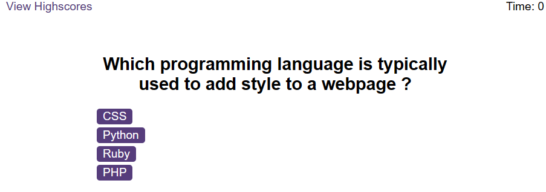

# Javascript Quiz

## Description

I have created a quiz using Javascript that plays different sounds  depending on if the answer is correct or incorrect.

## Technologies

JavaScript
HTML
CSS

## Installation

No steps are required for installation.

## Usage

https://theoburton.github.io/JS-Quiz

After navigating to the site, click start quiz will start the quiz and clicking on one of the answers should make a sound and open the next question page.

## License

PLease refer to the License agreement in the repository root.
